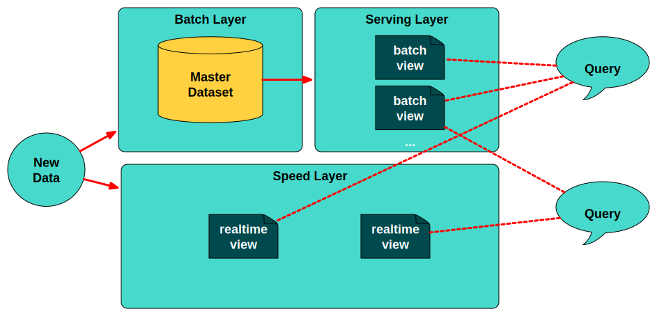

<!-- .slide: data-background="img/background_hadoop.jpg" -->

## In the beginning of Big Data there was <!-- .element: class="fragment" --> 
# HADOOP <!-- .element: class="fragment" --> 

---

<!-- .slide: data-background="img/background_map_reduce.jpg" -->

#Batch seems to be good <!-- .element: class="fragment" --> 
##map and reduce was everywhere <!-- .element: class="fragment" --> 

---

<!-- .slide: data-background="img/background_modern.jpg" -->

## But now Business does not wait. <!-- .element: class="fragment" --> 
### It always demands more... <!-- .element: class="fragment" --> 
# ever faster <!-- .element: class="fragment" --> 
  
---

<!-- .slide: data-background="img/background_modern.jpg" -->

- Updating machine learning models as new information arrives <!-- .element: class="fragment" --> 
- Detecting anomalies, faults, performance problems, etc. and taking timely action <!-- .element: class="fragment" --> 
- Aggregating and processing data on arrival for downstream storage and analytics <!-- .element: class="fragment" -->  
  
---

<!-- .slide: data-background="img/background-title-orig.jpg" -->

### λ-Architecture

---

### Fast Data 

<!-- .slide: data-background="img/background-title-orig.jpg" -->
 
> Fast Data covers a range of new systems and approaches, which balance various 
> tradeoffs to deliver timely, cost-efficient data processing, as well as higher developer productivity. 

---

### Requirements for a 
### Fast Data Architecture 

<!-- .slide: data-background="img/background-title-orig.jpg" -->
 
  - Reliable data ingestion <!-- .element: class="fragment" --> 
  - Flexible storage and query options <!-- .element: class="fragment" --> 
  - Sophisticated analytics tools <!-- .element: class="fragment" --> 
