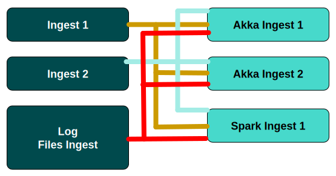
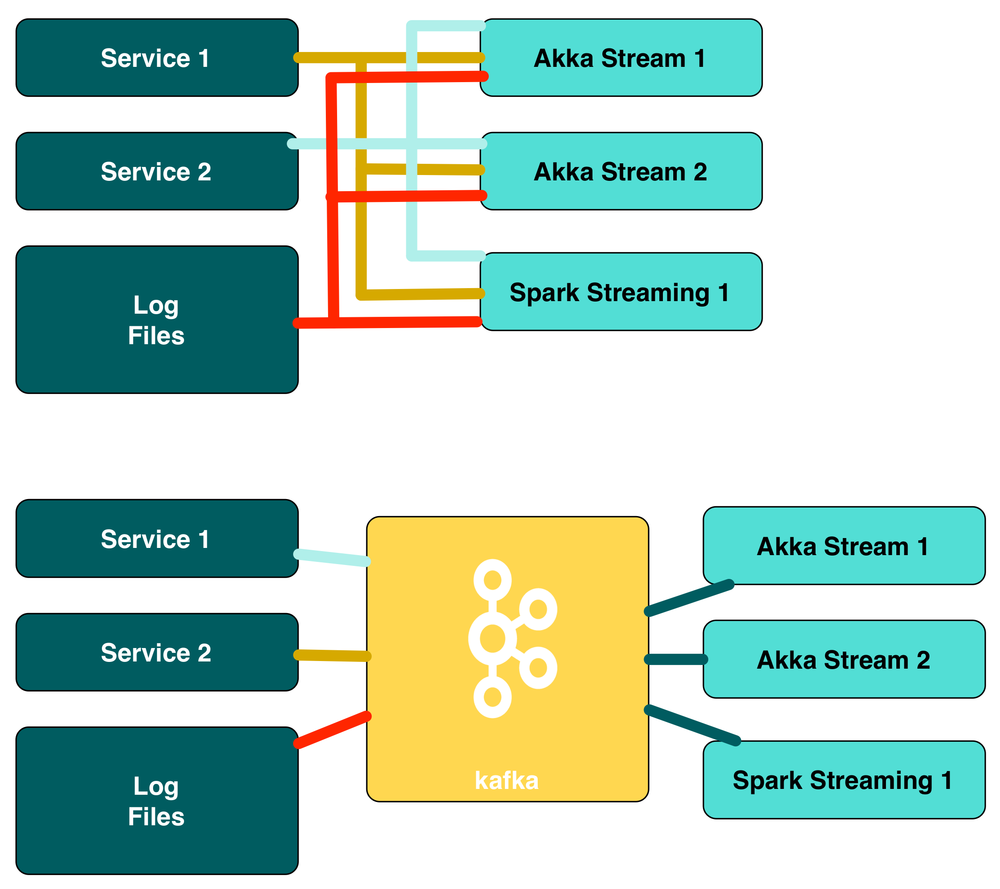
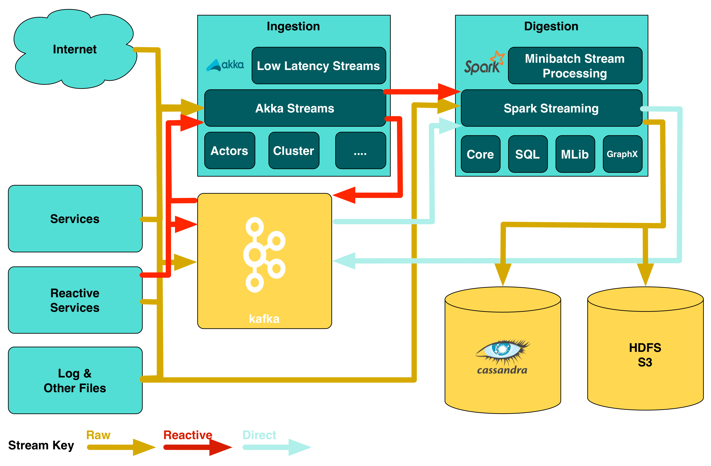
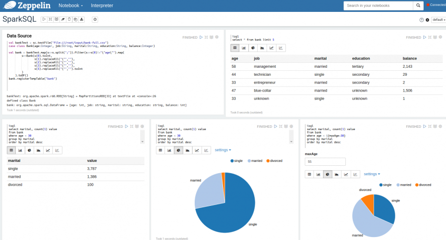
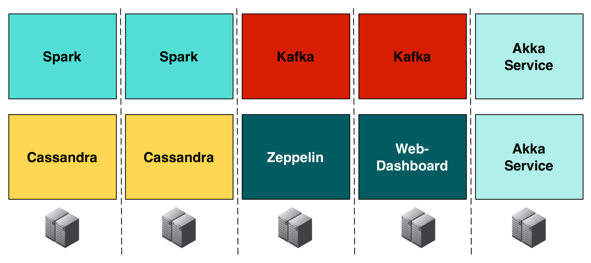

### SMACK

<!-- .slide: data-background="img/background-orange-orig.jpg" -->

- S park <!-- .element: class="fragment" --> 
- M esos <!-- .element: class="fragment" --> 
- A kka <!-- .element: class="fragment" --> 
- C assandra <!-- .element: class="fragment" --> 
- K afka <!-- .element: class="fragment" --> 

---

<!-- .slide: data-background="img/background-green-orig.jpg" -->

#### Swiss Army Knife for Data Processing

- ETL Jobs <!-- .element: class="fragment" --> 
- μ-Batching on Streams <!-- .element: class="fragment" --> 
- SQL and Joins on non-RDBMS <!-- .element: class="fragment" --> 
- Graph Operations on non-Graphs <!-- .element: class="fragment" --> 
- Super Fast Map/Reduce <!-- .element: class="fragment" --> 

---

<!-- .slide: data-background="img/background-green-orig.jpg" -->

###What about λ-Architectures? <!-- .element: class="fragment" --> 
####Spark Operations can be run unaltered in either batch or stream mode -  it is always an Resilient Distributed Dataset (RDD)! <!-- .element: class="fragment" --> 

---

<!-- .slide: data-background="img/background-green-orig.jpg" -->

### Mesos
#### Distributed Kernel for the Cloud

- Links machines to one logical instance <!-- .element: class="fragment" --> 
- Static deployment of Mesos <!-- .element: class="fragment" --> 
- Dynamic deployment of the workload <!-- .element: class="fragment" --> 
- Good integration with Hadoop, Kafka, Spark, and Akka <!-- .element: class="fragment" --> 

---

<!-- .slide: data-background="img/background-green-orig.jpg" -->

#### Framework for reactive applications

- Highly performant - 50 million messages per machine in a second <!-- .element: class="fragment" --> 
- Simple concurrency via asynchronous processing <!-- .element: class="fragment" --> 
- Elastic, resilient and without single point of failure <!-- .element: class="fragment" --> 
- Used for application that can process or query data <!-- .element: class="fragment" --> 
 
---

<!-- .slide: data-background="img/background-green-orig.jpg" -->

#### Performant and Always-Up NoSQL Database

- Linear scaling - approx. 10'000 requests per machine and second <!-- .element: class="fragment" --> 
- No Downtime <!-- .element: class="fragment" --> 
- Comfort of a column index with append-only performance Data-Safety over multiple data-centers <!-- .element: class="fragment" --> 
- Strong in denormalized models <!-- .element: class="fragment" --> 

---

<!-- .slide: data-background="img/background-green-orig.jpg" -->

### Kafka
#### Messaging system for Big Data applications
     
- Fast - Delivers hundreds of MegaBytes per second to 1000s of clients <!-- .element: class="fragment" --> 
- Scales - Partitions data to manageable volumes <!-- .element: class="fragment" --> 
- Managing backpressure <!-- .element: class="fragment" --> 
- Distributed - from the ground up <!-- .element: class="fragment" --> 

---

<!-- .slide: data-background="img/background-green-orig.jpg" -->

### Microservice World

---

<!-- .slide: data-background="img/background-green-orig.jpg" -->

### Kafka as a Multiplexer-Demultiplexer

---

### Emerging Architecture 

<!-- .slide: data-background="img/background-green-orig.jpg" -->

---

### Zeppelin

<!-- .slide: data-background="img/background-green-orig.jpg" -->

---

### Zeppelin

<!-- .slide: data-background="img/background-green-orig.jpg" -->

- &#x1f604; No Jar-Wars  <!-- .element: class="fragment" --> 
- &#x1f604; Easy Analytics  <!-- .element: class="fragment" --> 
- &#x1f621; New Technology  <!-- .element: class="fragment" --> 

---

### Traditional Approach

<!-- .slide: data-background="img/background-green-orig.jpg" -->

---

### DC/OS Approach

<!-- .slide: data-background="img/background-green-orig.jpg" -->

