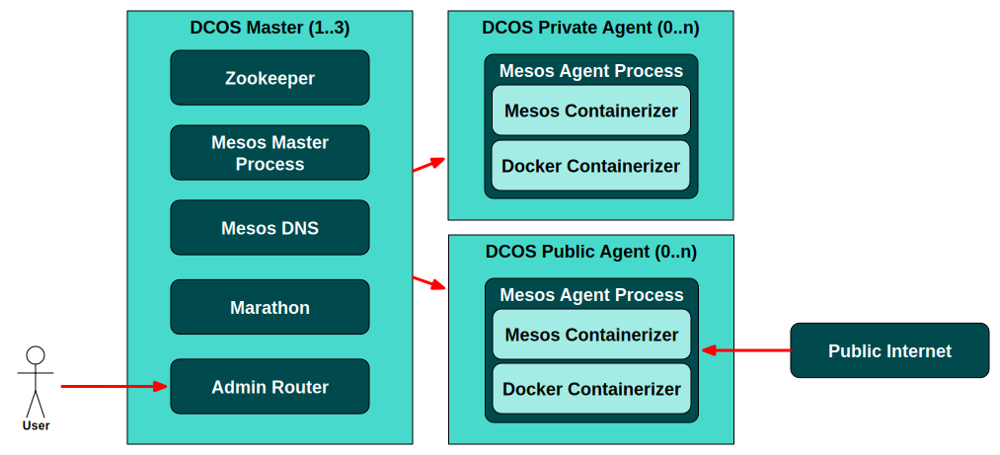
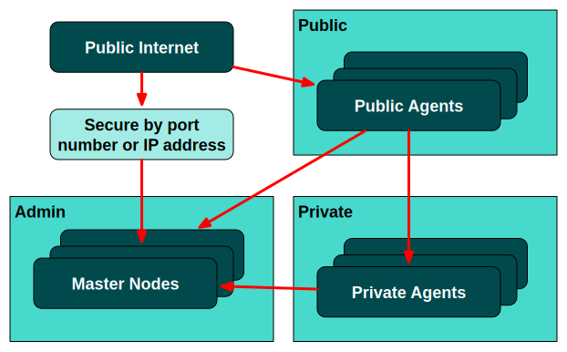
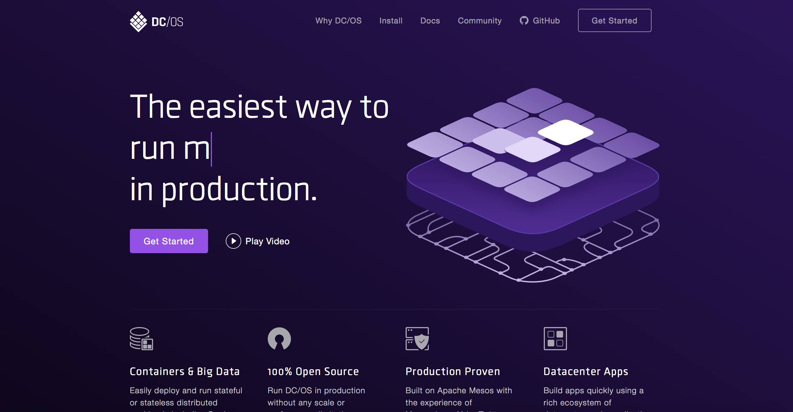
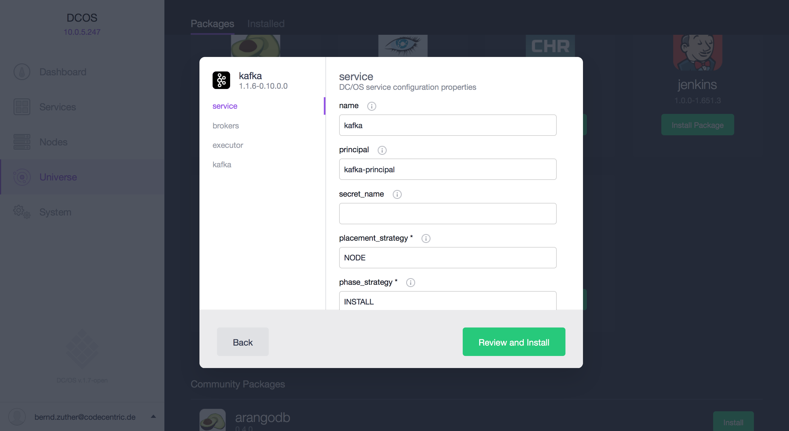

### DC/OS

<!-- .slide: data-background="img/background-orange-orig.jpg" -->


---

<!-- .slide: data-background="img/background-title-orig.jpg" -->

### DC/OS Architecture



---

### DC/OS Network Security



---

### DC/OS Installation

<!-- .slide: data-background="img/background-title-orig.jpg" -->



---

### DC/OS Universe

<!-- .slide: data-background="img/background-title-orig.jpg" -->



---

### Command Line Interface 

<!-- .slide: data-background="background-title-orig.jpg" -->

```bash
$ dcos
Command line utility for the Mesosphere Datacenter Operating
System (DC/OS). The Mesosphere DC/OS is a distributed operating
system built around Apache Mesos. This utility provides tools
for easy management of a DC/OS installation.

Available DC/OS commands:

    config          Get and set DC/OS CLI configuration properties
    help            Display command line usage information
    marathon        Deploy and manage applications on the DC/OS
    node            Manage DC/OS nodes
    package         Install and manage DC/OS packages
    service         Manage DC/OS services
    task            Manage DC/OS tasks

Get detailed command description with 'dcos <command> --help'.
```

---

### SMACK Installation (1)

<!-- .slide: data-background="img/background-title-orig.jpg" -->

```bash
dcos package install --yes cassandra
dcos package install --yes kafka
dcos package install --yes spark
dcos kafka topic add killrweather.raw
```

---

### SMACK Installation (2)

<!-- .slide: data-background="img/background-title-orig.jpg" -->

```bash
cat > /opt/smack/conf/killrweather_ingest.json << EOF
{
    "id": "/ingest",
    "container": {
        "type": "DOCKER",
        "docker": {
            "image": "zutherb/mesos-killrweather-app",
            "network": "HOST",
            "forcePullImage": true
        }
    },
    "cmd": "./ingest.sh -Dcassandra.connection.host=cassandra-dcos-node.cassandra.dcos.mesos -Dkafka.hosts.0=broker-0.kafka.mesos:1025 -Dkafka.zookeeper.connection=leader.mesos"
}
EOF
dcos marathon app add /opt/smack/conf/killrweather_ingest.json
```

---

### Service Discovery

<!-- .slide: data-background="img/background-title-orig.jpg" -->

<table style="font-size: 25px;">
    <thead>
        <tr>
            <th style="width:33%">DNS-based</th>
            <th style="width:33%">Proxy-based</th>
            <th style="width:33%">Application-aware</th>
        <tr>
    </thead>
    <thead>
        <tr>
            <td>&#x1f604; easy to integrate</td>
            <td>&#x1f604; no port conflicts</td>
            <td>&#x1f604; developer fully in control and full-feature</td>
        <tr>
        <tr>
            <td>&#x1f621; SRV records</td>
            <td>&#x1f604; fast failover</td>
            <td>&#x1f621; implementation effort</td>
        <tr>
        <tr>
            <td>&#x1f621; no health checks</td>
            <td>&#x1f621; no UDP</td>
            <td>&#x1f621; requires distributed state management (ZK, etcd or Consul)</td>
        <tr>
        <tr>
            <td>&#x1f621; TTL</td>
            <td>&#x1f621; management of VIPs (Minuteman) or service ports (Marathon-lb)</td>
            <td>&nbsp;</td>
        <tr>
    </thead>
</table>

---

### A Records

<!-- .slide: data-background="img/background-title-orig.jpg" -->

- An A record associates a hostname to an IP address

```bash
bz@cc ~/$ dig app.marathon.mesos

; <<>> DiG 9.9.5-3ubuntu0.7-Ubuntu <<>> app.marathon.mesos
;; global options: +cmd
;; Got answer:
;; ->>HEADER<<- opcode: QUERY, status: NOERROR, id: 9336
;; flags: qr aa rd ra; QUERY: 1, ANSWER: 2, AUTHORITY: 0, ADDITIONAL: 0

;; QUESTION SECTION:
;app.marathon.mesos.		IN	A

;; ANSWER SECTION:
app.marathon.mesos.	60	IN	A	10.0.3.201
app.marathon.mesos.	60	IN	A	10.0.3.199

;; Query time: 2 msec
;; SERVER: 10.0.5.98#53(10.0.5.98)
;; WHEN: Fri Jun 17 10:22:14 UTC 2016
;; MSG SIZE  rcvd: 68

```

---

### SRV Records

<!-- .slide: data-background="img/background-title-orig.jpg" -->

- A SRV record associates a service name to a hostname and an IP port

```bash
bz@cc ~/$  dig _app._tcp.marathon.mesos SRV


; <<>> DiG 9.9.5-3ubuntu0.7-Ubuntu <<>> _app._tcp.marathon.mesos SRV
;; global options: +cmd
;; Got answer:
;; ->>HEADER<<- opcode: QUERY, status: NOERROR, id: 31708
;; flags: qr aa rd ra; QUERY: 1, ANSWER: 2, AUTHORITY: 0, ADDITIONAL: 2

;; QUESTION SECTION:
;_app._tcp.marathon.mesos.	IN	SRV

;; ANSWER SECTION:
_app._tcp.marathon.mesos. 60	IN	SRV	0 0 10148 app-qtugm-s5.marathon.mesos.
_app._tcp.marathon.mesos. 60	IN	SRV	0 0 13289 app-t49o6-s2.marathon.mesos.

;; ADDITIONAL SECTION:
app-qtugm-s5.marathon.mesos. 60	IN	A	10.0.3.199
app-t49o6-s2.marathon.mesos. 60	IN	A	10.0.3.201

;; Query time: 2 msec
;; SERVER: 10.0.5.98#53(10.0.5.98)
;; WHEN: Fri Jun 17 10:21:29 UTC 2016
;; MSG SIZE  rcvd: 194

```


---

### DNS Pattern

<!-- .slide: data-background="img/background-title-orig.jpg" -->

<table style="font-size: 20px;">
    <thead>
        <tr>
            <th>Service</th>
            <th>CT-IP Avail</th>
            <th>DI Avail</th>
            <th>Target Host</th>
            <th>Target Port</th>
            <th>A (Target Resolution)</th>
        </tr>
    </thead>
    <tbody>
        <tr>
            <td><em>{task}.</em>{proto}.framework.domain</td>
            <td>no</td>
            <td>no</td>
            <td>{task}.framework.slave.domain</td>
            <td>host-port</td>
            <td>slave-ip</td>
        </tr>
        <tr>
            <td></td>
            <td>yes</td>
            <td>no</td>
            <td>{task}.framework.slave.domain</td>
            <td>host-port</td>
            <td>slave-ip</td>
        </tr>
        <tr>
            <td></td>
            <td>no</td>
            <td>yes</td>
            <td>{task}.framework.domain</td>
            <td>di-port</td>
            <td>slave-ip</td>
        </tr>
        <tr>
            <td></td>
            <td>yes</td>
            <td>yes</td>
            <td>{task}.framework.domain</td>
            <td>di-port</td>
            <td>container-ip</td>
        </tr>
        <tr>
            <td><em>{task}.</em>{proto}.framework.slave.domain</td>
            <td>n/a</td>
            <td>n/a</td>
            <td>{task}.framework.slave.domain</td>
            <td>host-port</td>
            <td>slave-ip</td>
        </tr>
    </tbody>
</table>

---

Benefits and downsides of DC/OS

<!-- .slide: data-background="img/background-title-orig.jpg" -->

- &#x1f604; Layer that abstract hardware  <!-- .element: class="fragment" --> 
- &#x1f604; Applicaton run in a sandbox with and without Docker <!-- .element: class="fragment" --> 
- &#x1f604; Buildin service discovery <!-- .element: class="fragment" --> 
- &#x1f621; Effort to training the technology <!-- .element: class="fragment" --> 
- &#x1f621; Monitoring gets a bigger rule <!-- .element: class="fragment" --> 