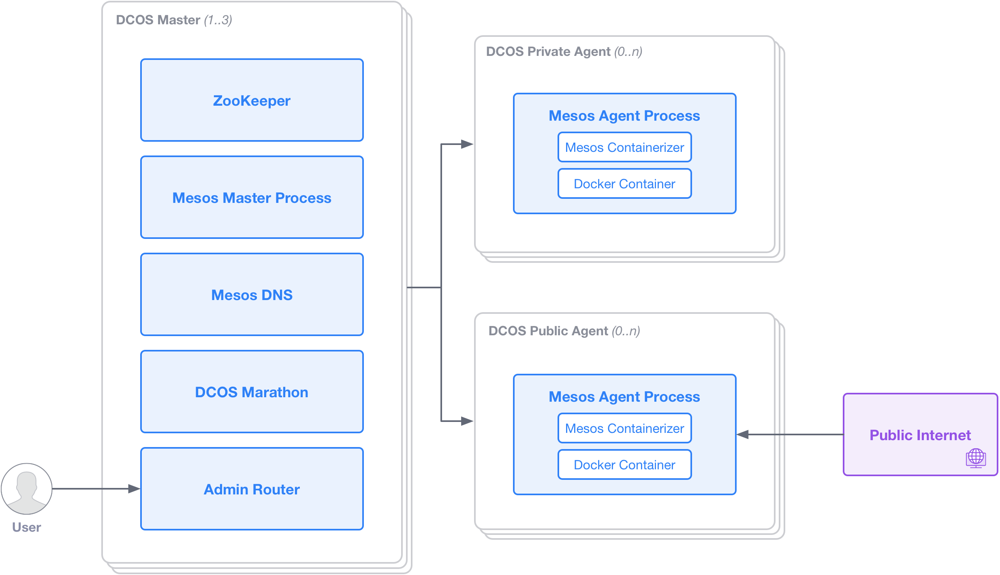

### DC/OS

<!-- .slide: data-background="img/background-orange-orig.jpg" -->


---

<!-- .slide: data-background="img/background-title-orig.jpg" -->

### Architecture



---

### Network Security


---

### DC/OS Installation

<!-- .slide: data-background="img/background-green-orig.jpg" -->


---

### SMACK Installation (1)

<!-- .slide: data-background="img/background-green-orig.jpg" -->

```bash
dcos package install --yes cassandra
dcos package install --yes kafka
dcos package install --yes spark
dcos kafka topic add killrweather.raw
dcos package install --yes zeppelin
```

---

### SMACK Installation (2)

<!-- .slide: data-background="img/background-title-orig.jpg" -->

```bash
cat > /opt/smack/conf/killrweather_ingest.json << EOF
{
    "id": "/ingest",
    "container": {
        "type": "DOCKER",
        "docker": {
            "image": "zutherb/mesos-killrweather-app",
            "network": "HOST",
            "forcePullImage": true
        }
    },
    "cmd": "./ingest.sh -Dcassandra.connection.host=cassandra-dcos-node.cassandra.dcos.mesos -Dkafka.hosts.0=broker-0.kafka.mesos:1025 -Dkafka.zookeeper.connection=leader.mesos"
}
EOF
dcos marathon app add /opt/smack/conf/killrweather_ingest.json
```
