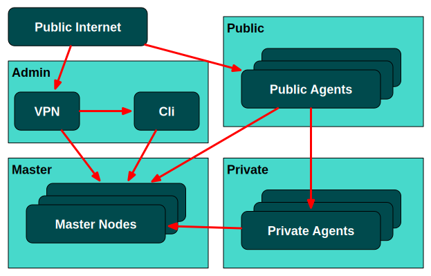
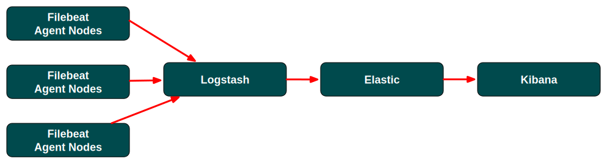
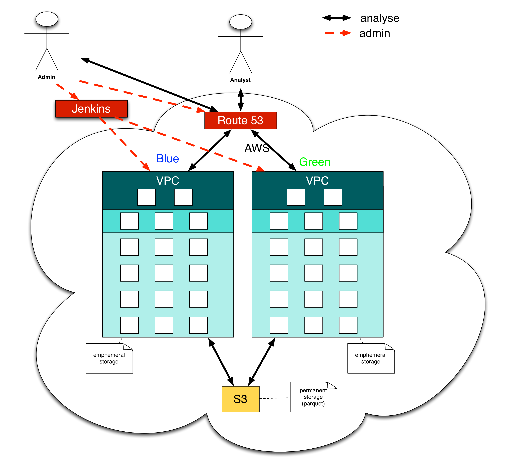

<!-- .slide: data-background="img/background-orange-orig.jpg" -->

### Extend our DC/OS cluster


---

<!-- .slide: data-background="img/background-green-orig.jpg" -->

### Add new Network Security Zone



---

<!-- .slide: data-background="img/background-green-orig.jpg" -->

### Add ELK



---

<!-- .slide: data-background="img/background-green-orig.jpg" -->

### Start Filebeat

```
  - "command": |-
      start
    "content": |
      [Unit]
      Description=ELK: Filebeat collectes log file and send them to logstash
      Requires=filebeat-download.service
      After=filebeat-download.service
      [Service]
      Type=simple
      StandardOutput=journal+console
      StandardError=journal+console
      ExecStart=docker run filebeat -e -c /etc/filebeat/filebeat.yml -d "publish"
    "enable": !!bool |-
      true
    "name": |-
      filebeat.service
```

---

### Working with Cloudformation

<!-- .slide: data-background="img/background-green-orig.jpg" -->


- &#x1f604; Easy integration in a build pipeline  <!-- .element: class="fragment" --> 
- &#x1f621; Hard to maintain  <!-- .element: class="fragment" --> 
- &#x1f621; Hard to extend  <!-- .element: class="fragment" --> 
- &#x1f621; Not Cloud-agnostic (only support AWS) <!-- .element: class="fragment" --> 

---

### Terraform
#### Build, Combine, and Launch Infrastructure

<!-- .slide: data-background="img/background-green-orig.jpg" -->


- Infrastructure as code <!-- .element: class="fragment" --> 
- Combine Multiple Providers (AWS, Azure, etc.) <!-- .element: class="fragment" --> 
- Evolve your Infrastructure <!-- .element: class="fragment" --> 

---

### Terraform - Resource

<!-- .slide: data-background="img/background-green-orig.jpg" -->

```
resource "aws_launch_configuration" "public_slave" {
  security_groups = ["${aws_security_group.public_slave.id}"]
  image_id = "${lookup(var.coreos_amis, var.aws_region)}"
  instance_type = "${var.public_slave_instance_type}"
  key_name = "${aws_key_pair.dcos.key_name}"
  user_data = "${template_file.public_slave_user_data.rendered}"
  associate_public_ip_address = true

  lifecycle {
    create_before_destroy = false
  }
}
```

---

### Terraform - Builds or changes infrastructure

<!-- .slide: data-background="img/background-green-orig.jpg" -->

``` bash
$ terraform apply
Remote state configured and pulled.
data.template_file.instana_configuration_admin_data: Refreshing state...
data.template_file.instana_configuration_public_slave_data: Refreshing state...
data.template_file.instana_configuration_master_data: Refreshing state...
data.template_file.instana_configuration_slave_data: Refreshing state...
aws_vpc_dhcp_options.dcos: Refreshing state... (ID: dopt-01326d68)
```

---

### Benefits of Terraform

<!-- .slide: data-background="img/background-green-orig.jpg" -->

- &#x1f604; Easy integration in a build pipeline  <!-- .element: class="fragment" --> 
- &#x1f604; Easier to maintain  <!-- .element: class="fragment" --> 
- &#x1f604; Easier to extend  <!-- .element: class="fragment" --> 
- &#x1f604; Cloud-agnostic (AWS, Azure, Profitbricks) <!-- .element: class="fragment" --> 
- &#x1f621; Need some time until new resources are adopted  <!-- .element: class="fragment" --> 

---

### Create infrastructure with Jenkins

<!-- .slide: data-background="img/background-green-orig.jpg" -->



---

### Terraform - Real World Example

<!-- .slide: data-background="img/background-green-orig.jpg" -->

<p>
    <ul>
        <li><a style="color:white" href="https://github.com/ANierbeck/BusFloatingData">https://github.com/ANierbeck/BusFloatingData</a></li>
        <li><a style="color:white" href="https://github.com/zutherb/terraform-dcos">https://github.com/zutherb/terraform-dcos/</a></li>
    </ul>
</p>  
